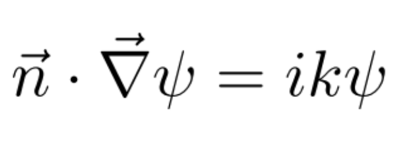

# 1D Quantum Particle Detection with Absorbing Boundary Condition

This project provides a visual for the evolution of a particle's wave function in one space dimension, where hard detectors are represented mathematically as absorbing boundary conditions in a 1D Schrödinger model. This idea was introduced [here](https://arxiv.org/abs/1911.12730).

### Absorbing boundary condition

## Methodology

We use the Crank-Nicolson method to solve a 1D time-independent Schrödinger equation with the above absorbing boundary conditions. The initial wave function is a Gaussian wave packet.

## Animation

<video src="https://raw.githubusercontent.com/armenkarakashian/1D-Particle-Detection-ABC/main/visuals/(0.125x)4KSidebySidePsi2.mp4" controls="controls" style="max-width: 100%;">
   Your browser does not support the video tag.
</video>